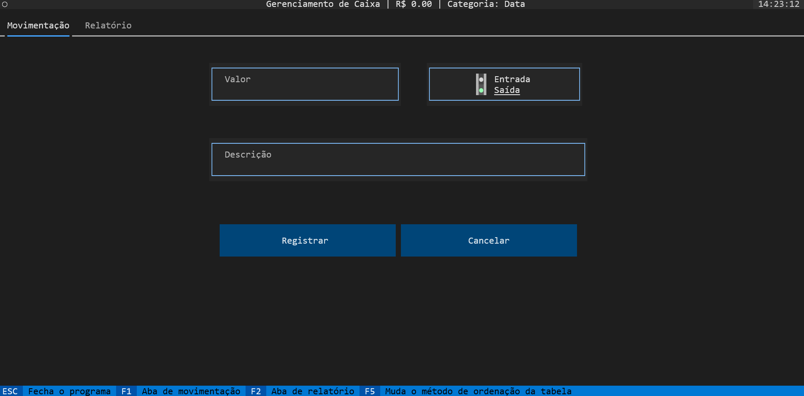

# 💱 PecManager - Gerenciamento de Caixa

[]()  []()  []()  []()

## Descrição
O PecManager é um sistema de gerenciamento de caixa, que permite o controle de entrada e saída de valores, assim como a visualização de seu histórico; futuramente irá permitir a geração de relatórios e gráficos para melhor visualização dos dados.


## Layout

### Tela de Movimentação



## Tecnologias

- [Python](https://www.python.org/)
- [TinyDB](https://tinydb.readthedocs.io/en/latest/)
- [Textual](https://textual.textualize.io/)

## Instalação

### Pré-requisitos

- [Python 3.11](https://www.python.org/)

### Instalação

1. Clone o repositório:
   ```sh
   git clone https://github.com/Lusqinha/PecManager.git
    ```
2. Instale as dependências:
    ```sh
    pip install -r requirements.txt
    ```
    ou execute o arquivo `install.bat` (Windows) ou `install.sh` (Linux)

3. Execute o arquivo `main.py`:
    
    Windows:
    ```sh
    python main.py
    ```
    Linux:
    ```sh
    python3 main.py
    ```

## Licença

Distribuído sob a licença MIT. Veja `LICENSE` para mais informações.